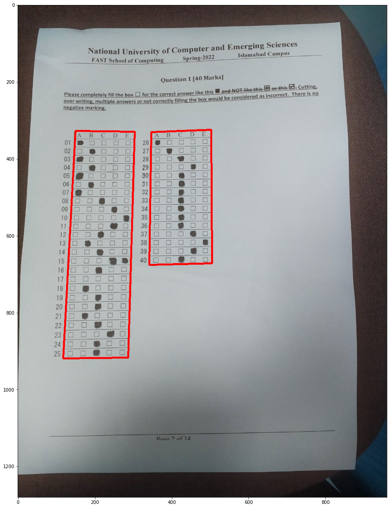
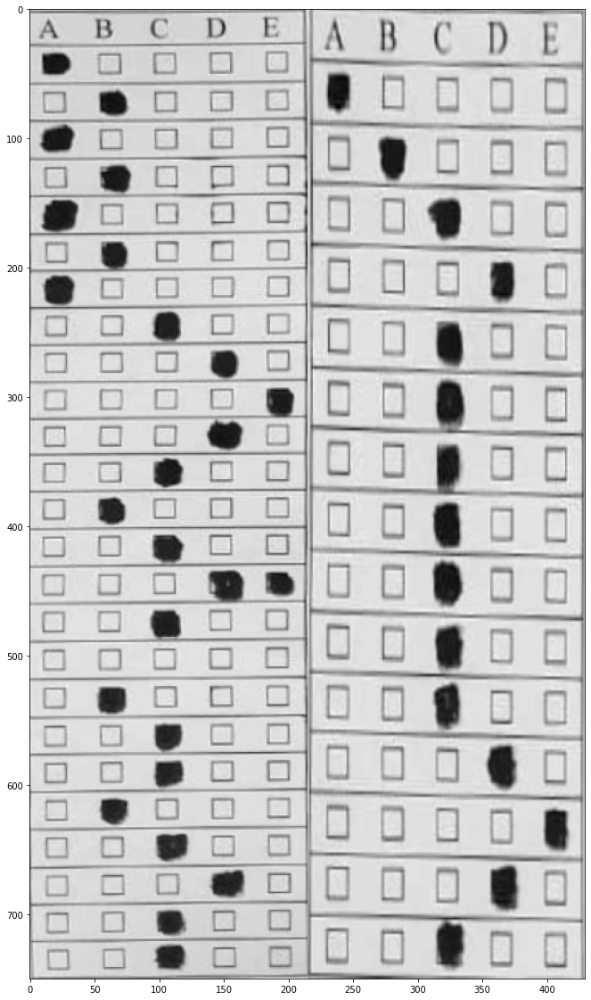
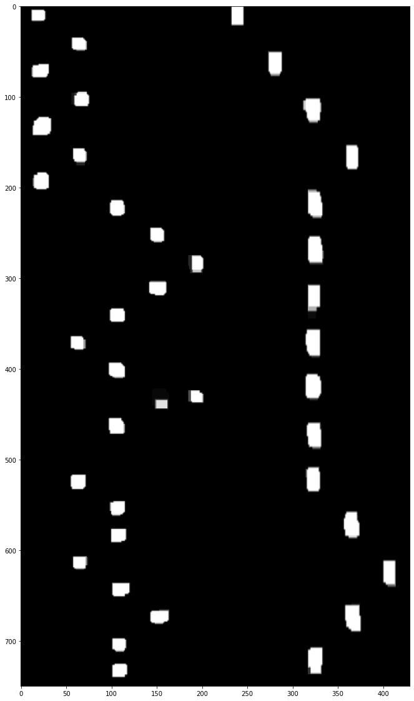
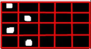

# Bubble-Check

Este projeto aproveita o poder da visão computacional para ajudar professores a corrigir exames de múltipla escolha de forma rápida e precisa. Professores podem escanear as folhas de resposta, carregar a solução e o sistema irá automaticamente corrigir os exames e fornecer um relatório detalhado dos resultados. Este projeto é uma solução perfeita para professores que procuram economizar tempo e esforço na correção de exames.

## Como Funciona
- A imagem é convertida para escala de cinza e então o desfoque Gaussiano é aplicado para remover ruídos.
- A imagem é então cortada para a área de interesse através da detecção de contornos.
- A imagem é então convertida para binário usando limiarização adaptativa.
- A imagem é então aberta (Erosão seguida por Dilatação) para remover ruídos.
- A imagem é então dividida em células.
- As células são então verificadas quanto a pixels brancos.
- Uma célula é considerada marcada se o número de pixels brancos for maior que um limiar definido.
- Uma questão é considerada desmarcada se não houver opções marcadas ou se mais de uma opção for marcada na mesma linha.
- As opções marcadas são então comparadas com as respostas corretas para calcular a pontuação.

## Demonstração 
||
|:--:|
|*Detecção de Contornos*|

||
|:--:|
|*Imagem Transformada*|

||
|:--:|
|*Imagem Binária*|


||
|:--:|
|*Células da Imagem*|

## Como Usar
||
|:--:|
|*Criar Exame*|

||
|:--:|
|*Nome do Exame*|

||
|:--:|
|*Carregar Solução*|


||
|:--:|
|*Carregar Respostas*|


||
|:--:|
|*Detalhes do Exame*|


||
|:--:|
|*Todos os Exames*|

## Ações Individuais do Exame:
Você pode agora realizar as seguintes ações:
- **Carregar uma Nova Solução:** Clique em 'Upload Solution' para fornecer uma nova solução.
- **Gerar Relatório:** Clique em 'Generate Report' e ele irá gerar um relatório atualizado.
- **Carregar Nova Imagem para Pontuar:** Você pode carregar mais imagens clicando no botão 'Upload an Image' e então gerar um novo relatório para pontuá-las.
- **Baixar CSV:** Você pode baixar o arquivo CSV do relatório.

## Como Iniciar o Projeto

Siga os passos abaixo para configurar e executar o projeto.

### 1. Pré-requisitos

Certifique-se de ter o seguinte software instalado em sua máquina:

*   [Python 3.8+](https://www.python.org/downloads/)
*   [pip](https://pip.pypa.io/en/stable/installation/) (gerenciador de pacotes Python)
*   [Node.js](https://nodejs.org/en/download/) (versão LTS recomendada)
*   [npm](https://www.npmjs.com/get-npm) ou [Yarn](https://classic.yarnpkg.com/en/docs/install/) (gerenciador de pacotes JavaScript)

### 2. Configuração do Backend (Servidor Python)

1.  Navegue até o diretório `server`:
    ```bash
    cd server
    ```
2.  Crie um ambiente virtual (recomendado) e ative-o:
    ```bash
    python -m venv venv
    # No Windows
    .\venv\Scripts\activate
    # No macOS/Linux
    source venv/bin/activate
    ```
3.  Instale as dependências Python:
    ```bash
    pip install -r req.txt
    ```
4.  Inicie o servidor FastAPI:
    ```bash
    uvicorn server:app --reload
    ```
    O servidor estará rodando em `http://127.0.0.1:8000` (ou um endereço similar).

### 3. Configuração do Frontend (Aplicação Next.js)

1.  Abra um novo terminal e navegue até o diretório `client`:
    ```bash
    cd client
    ```
2.  Instale as dependências JavaScript (usando npm ou Yarn):
    ```bash
    npm install
    # ou
    yarn install
    ```
3.  Inicie o servidor de desenvolvimento Next.js:
    ```bash
    npm run dev
    # ou
    yarn dev
    ```
4.  Abra seu navegador e acesse `http://localhost:3000` para ver a aplicação em funcionamento.

## Colaboradores
- [Hamza Iftikhar](https://github.com/hmzaiftkhar)
- [Hamza Khalid](https://github.com/hmzakhalid)
